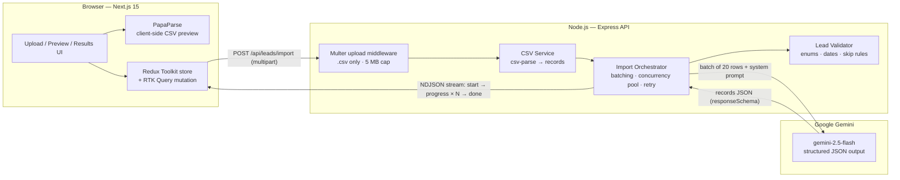
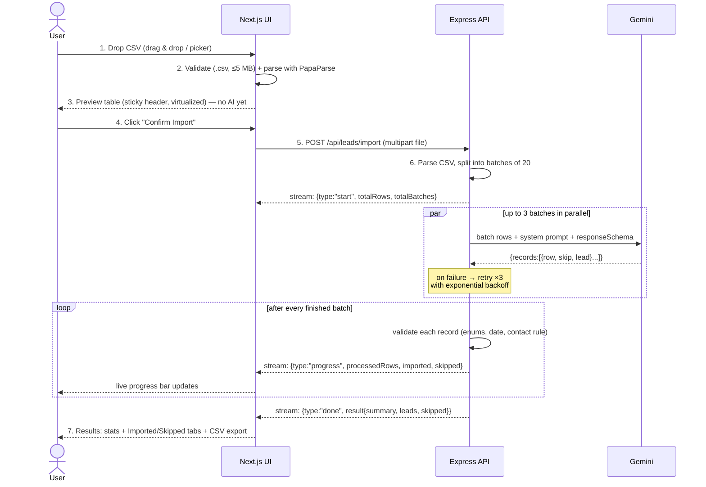
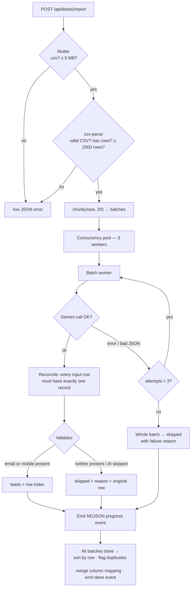
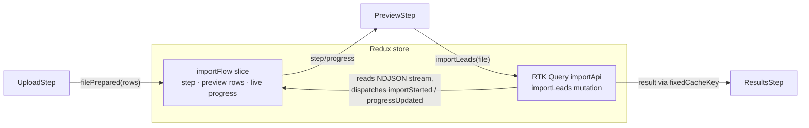

# System Design — GrowEasy AI CSV Lead Importer

One page to understand how the whole system works: what talks to what, how a CSV becomes CRM leads, and why it is built this way.

## 1. High-Level Overview

The system is **stateless** — no database. A CSV goes in, structured CRM leads come out, nothing is persisted server-side.

## 2. End-to-End Flow (what the user experiences)

## 3. Backend Request Pipeline

**Why each stage exists**

| Stage | Reason |
| ----- | ------ |
| Multer memory storage | Files are ≤ 5 MB — no temp-file cleanup, works on read-only hosts |
| Batching (20 rows) | Keeps each prompt small → accurate mapping + bounded response size |
| Concurrency pool (3) | Parallel speed without hammering Gemini rate limits |
| Retry ×3, exponential backoff | LLM calls fail transiently; a failed batch never kills the import |
| Reconciliation | If the model drops/duplicates a row index, the row is surfaced as skipped instead of silently lost |
| Server-side validator | Never trust LLM output alone: re-enforces status/source enums, `new Date()` parseability, digit-only mobiles, the "no email & no mobile → skip" rule, and single-line CSV safety |
| Duplicate flagging | Leads sharing an email/mobile with an earlier row get `duplicateOf` — the CRM user decides, nothing is silently dropped |
| Mapping merge | Each batch reports source→CRM column mapping; first confident answer wins, shown to the user for transparency |
| Cancel awareness | `res.on('close')` marks the client gone; pending batch workers stop before their Gemini call, saving quota |
| helmet + rate limit | Security headers and 30 imports/IP/15 min on the import route |

## 4. AI Extraction Design

The prompt engineering lives in one file: [`backend/src/prompts/extraction.prompt.ts`](backend/src/prompts/extraction.prompt.ts)

1. **System prompt** teaches the model the 15 GrowEasy CRM fields, synonym hints per field (e.g. `lead_owner` ← owner/agent/assigned_to), status/source mapping tables, Indian phone & date conventions, and the multi-email/multi-phone overflow rules.
2. **Structured output** — Gemini is called with `responseMimeType: application/json` + a strict `responseSchema`, so the response is machine-parseable by construction (no regex extraction from prose).
3. **Row indices** — every row is sent as `{row: N, data: {...}}` and the model must return the same indices, which makes results order-independent and verifiable.
4. **Temperature 0** for deterministic mapping.
5. **Explainability** — the model also returns a `mapping` array (source column → CRM field) so the user can audit exactly how their file was interpreted.

## 5. Frontend State Design

- The **RTK Query mutation uses a custom `queryFn`** that `fetch`es the endpoint and incrementally reads the NDJSON body — progress events are dispatched into the slice as they arrive, and the final `done` payload becomes the mutation result.
- `fixedCacheKey` shares the mutation state between the Preview step (which triggers it) and the Results step (which renders it) without prop drilling or duplicating state.
- The raw `File` object stays in component state (non-serializable), while everything renderable lives in Redux.
- Both tables use one reusable **virtualized `DataTable`** (fixed row height + windowing + sticky header), so a 2,000-row preview renders ~60 DOM rows.

## 6. Error Handling Matrix

| Failure | Where caught | What the user sees |
| ------- | ------------ | ------------------ |
| Wrong file type / too large | Frontend first, backend re-checks (Multer) | Inline error banner on the dropzone |
| Malformed CSV | Backend `csv-parse` → 400 | Error banner with parse detail + "Try again" |
| Single AI batch fails ×3 | Import orchestrator | Import continues; that batch's rows appear in **Skipped** with the failure reason; `failedBatches` shown in stats |
| Network drop mid-stream | RTK Query `queryFn` | Error banner with retry — no partial/corrupt result state |
| Row without email & mobile | Validator (and prompt) | Row listed in **Skipped** with reason |
| Invalid enum / date from the LLM | Validator coerces to `""` | Field shows as empty rather than invalid |
| User cancels mid-import | RTK `abort()` → fetch signal; backend detects the closed socket | "Import cancelled." banner; backend stops spending AI calls |
| Same contact appears twice | `flagDuplicates` post-pass | Amber `DUP` badge pointing at the original row |
| Import endpoint abused | `express-rate-limit` (30/IP/15 min) + `helmet` | 429 with a clear message |

## 7. Key Design Decisions

1. **NDJSON streaming over one long request** — real progress for a job that can take ~30–60 s, without the complexity of WebSockets/SSE-reconnect or a job queue. One HTTP request, incremental JSON lines.
2. **Stateless backend** — the assignment needs no persistence; skipping a DB removes migrations, cleanup jobs and hosting cost. Adding one later only touches the orchestrator's "done" step.
3. **Prompt + validator double layer** — the prompt makes the model *likely* to be right; the validator makes the output *guaranteed* to satisfy the CRM contract (allowed enums, parseable dates, contact-info rule).
4. **Preview parsed client-side** — instant feedback with zero server round-trip, and it honours the requirement that no AI runs before confirmation.
5. **Everything typed end-to-end** — the `StreamEvent`/`ImportResult` types mirror each other on both sides, so a contract change is a compile error, not a runtime surprise.
6. **Trust but verify the AI, then show your work** — structured output constrains the model, the validator guarantees the contract, and the mapping panel + `DUP` flags let a human audit the result instead of blindly trusting it.
7. **Fail soft, never silently** — a failed batch becomes visible skipped rows, a cancelled import stops cleanly, rate-limited clients get a clear 429; no failure mode loses data without telling the user.
