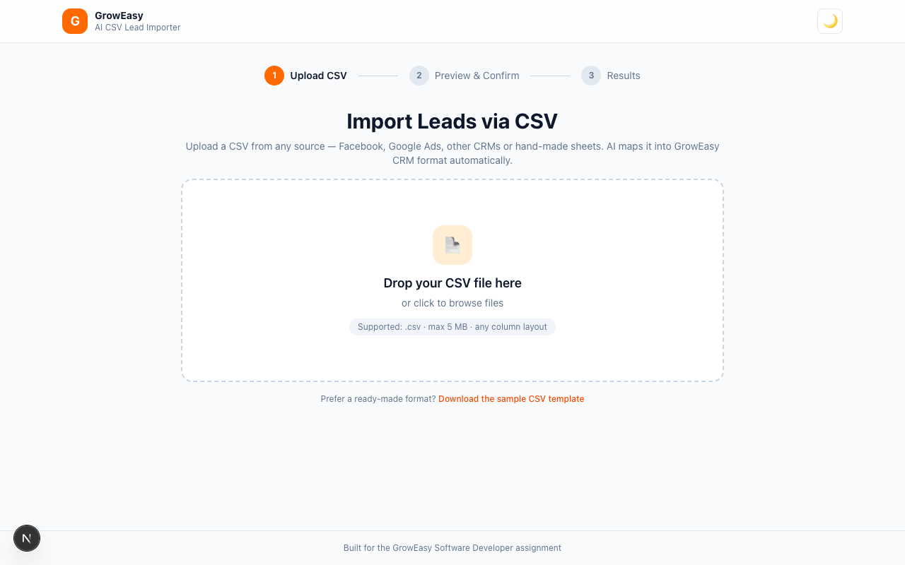
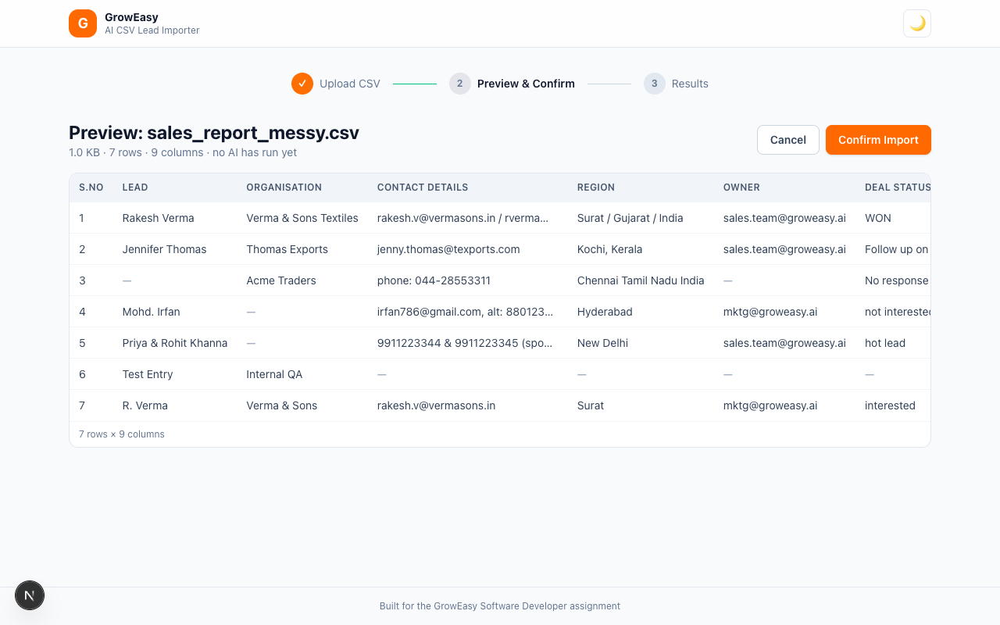
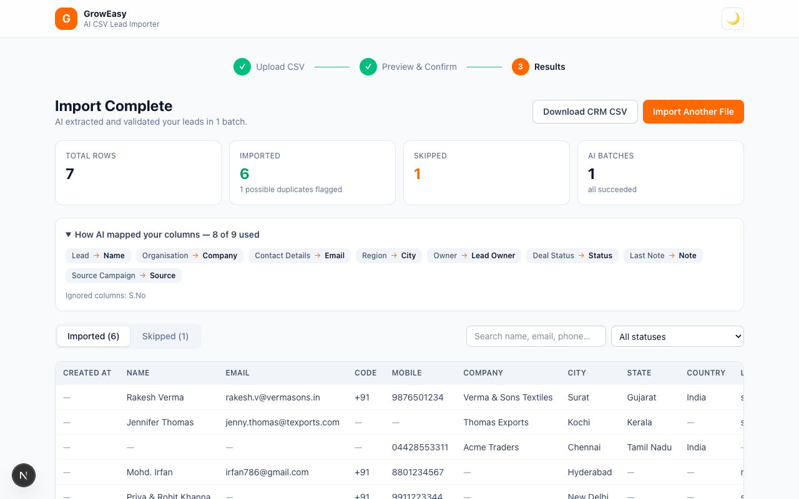
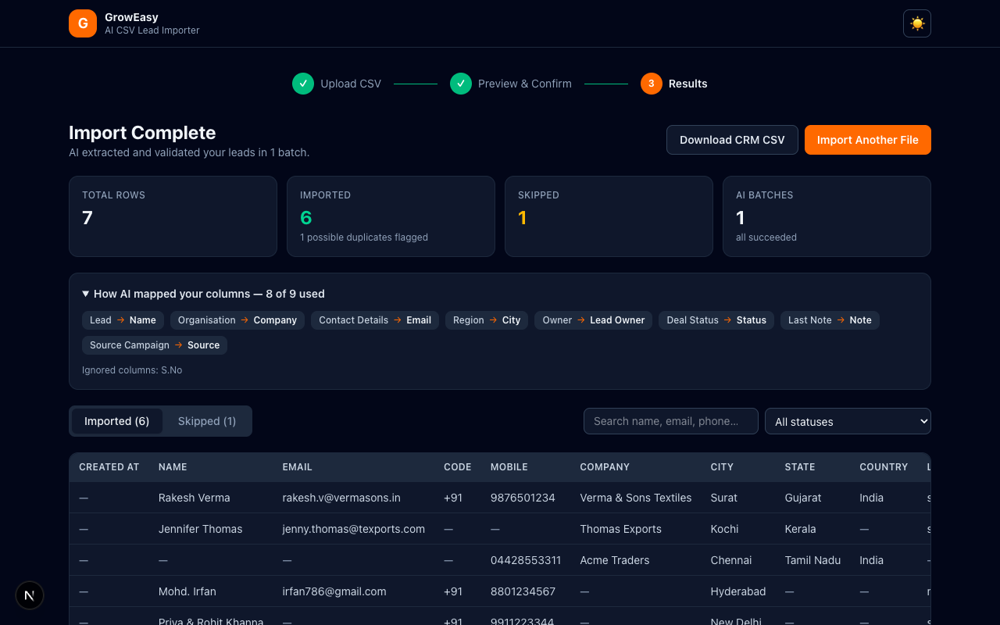
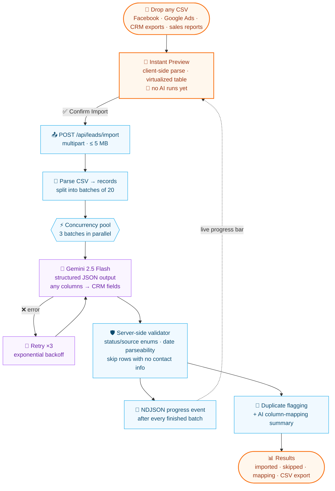
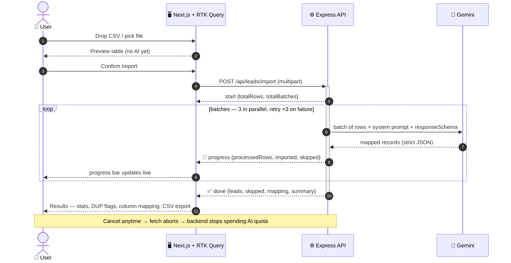

# GrowEasy — AI-Powered CSV Lead Importer

Import CRM leads from **any CSV format** — Facebook exports, Google Ads exports, real-estate CRM dumps, sales reports or hand-made spreadsheets. The system uses **Google Gemini** to intelligently map arbitrary columns into the GrowEasy CRM schema, validates every record server-side, and streams live progress to the UI.

> 📐 See [ARCHITECTURE.md](ARCHITECTURE.md) for the full system design, diagrams and design decisions.

## Features

**Core flow**

- Upload CSV via drag & drop or file picker (client-side validation: `.csv`, max 5 MB)
- Instant preview in a virtualized, sticky-header table — **no AI runs before you confirm**
- On confirm, the backend parses the CSV, batches rows and extracts leads with Gemini
- Results view with imported/skipped tabs, summary stats and a "Download CRM CSV" export

**Engineering highlights**

- ✅ Batch processing with a concurrency pool (default: 20 rows/batch, 3 batches in parallel)
- ✅ Retry with exponential backoff for failed AI batches (default: 3 attempts)
- ✅ Live progress streamed over NDJSON — the progress bar reflects real batch completion
- ✅ Double validation: strict prompt + Gemini structured output (`responseSchema`) **and** a server-side validator that enforces enums, date parseability and the email/mobile skip rule
- ✅ **Column-mapping transparency** — the AI reports how every source column was mapped, shown in the results view
- ✅ **Duplicate detection** — leads sharing an email/mobile with an earlier row get a `DUP` flag pointing to the original
- ✅ **Cancellable imports** — aborting mid-import stops the backend from spending further AI calls
- ✅ Search + status filter on imported results, one-click CSV export of imported **and** skipped rows
- ✅ Virtualized preview & result tables (smooth even with thousands of rows)
- ✅ Dark mode, loading states, retryable error banners
- ✅ Security hardening: `helmet` headers + per-IP rate limiting on the import endpoint
- ✅ Unit tests (Vitest) on both ends — validator, async utilities, duplicate flagging, NDJSON stream reader, CSV header normalization
- ✅ Docker + docker-compose setup, GitHub Actions CI (typecheck + tests + build for both apps)
- ✅ Fully typed TypeScript on both ends, no `any`

## Screenshots

| Upload | Preview |
| --- | --- |
|  |  |

| Results & AI column mapping | Dark mode |
| --- | --- |
|  |  |

## How It Works



Live progress is real, not simulated — the backend streams one NDJSON event per finished AI batch over a single HTTP response:



## Tech Stack

| Layer     | Choice                                                              |
| --------- | ------------------------------------------------------------------- |
| Frontend  | Next.js 15 (App Router), TypeScript, Redux Toolkit + **RTK Query**, Tailwind CSS v4, PapaParse |
| Backend   | Node.js, Express, TypeScript (ESM), Multer, csv-parse               |
| AI        | Google Gemini (`gemini-2.5-flash`) via `@google/genai` with structured JSON output |
| Database  | None — the service is stateless by design                           |

## Project Structure

```
GrowEasy/
├── frontend/          # Next.js app (upload → preview → confirm → results)
│   └── src/
│       ├── app/       # layout, page, providers, global styles
│       ├── components/# ui/, upload/, preview/, results/, DataTable
│       ├── store/     # Redux store, import slice, RTK Query API
│       ├── lib/       # csv parsing, ndjson stream reader, csv export, helpers
│       └── types/     # shared lead/CRM types
├── backend/           # Express API
│   └── src/
│       ├── routes/ → controllers/ → services/ (csv, ai, import orchestrator)
│       ├── prompts/   # Gemini system prompt + response schema
│       ├── validators/# server-side lead validation rules
│       ├── middlewares/ (multer upload, error handler)
│       ├── config/    # env loading
│       └── utils/     # chunk, retry, concurrency pool
├── samples/           # messy sample CSVs to try (Facebook, real-estate, sales report)
├── docker-compose.yml
└── ARCHITECTURE.md    # system design
```

## Getting Started

### Prerequisites

- Node.js ≥ 20
- A Google Gemini API key — free at [aistudio.google.com/apikey](https://aistudio.google.com/apikey)

### 1. Backend

```bash
cd backend
npm install
cp .env.example .env        # then paste your GEMINI_API_KEY
npm run dev                 # http://localhost:4000
```

### 2. Frontend

```bash
cd frontend
npm install
cp .env.example .env.local  # NEXT_PUBLIC_API_URL=http://localhost:4000 (default)
npm run dev                 # http://localhost:3000
```

Open **http://localhost:3000** and drop in one of the files from [`samples/`](samples/).

### Run with Docker

```bash
GEMINI_API_KEY=your_key docker compose up --build
# web: http://localhost:3000 · api: http://localhost:4000
```

### Deploy (Vercel + Render)

- **Backend → Render**: the repo ships a [render.yaml](render.yaml) blueprint. In Render: *New → Blueprint → select this repo*, set `GEMINI_API_KEY`, deploy. Render runs a persistent Node server, so long-running NDJSON streaming imports work without serverless timeouts.
- **Frontend → Vercel**: import the repo, set **Root Directory** to `frontend`, add env var `NEXT_PUBLIC_API_URL=https://<your-render-service>.onrender.com`, deploy.
- Optionally set `ALLOWED_ORIGIN=https://<your-vercel-app>.vercel.app` on Render to lock CORS down.

> Note: Render's free tier spins the API down after ~15 idle minutes — the first request after a pause takes ~30–50 s to wake it.

### Tests

```bash
cd backend && npm test    # validator, async utils, duplicate flagging
cd frontend && npm test   # NDJSON stream reader, CSV header normalization, formatters
```

## API

### `GET /api/health`

Liveness check → `{ "status": "ok" }`

### `POST /api/leads/import`

`multipart/form-data` with a `file` field (CSV, ≤ 5 MB, ≤ 2000 rows).

Responds with **NDJSON** (one JSON event per line) so the client can render live progress:

```jsonc
{"type":"start","totalRows":120,"totalBatches":6}
{"type":"progress","processedRows":20,"totalRows":120,"completedBatches":1,"totalBatches":6,"imported":18,"skipped":2}
...
{"type":"done","result":{
  "summary":{"totalRows":120,"imported":112,"skipped":8,"duplicates":3,"totalBatches":6,"failedBatches":0},
  "leads":[{"row":0,"created_at":"2026-05-13 14:20:48","name":"John Doe","email":"john.doe@example.com","duplicateOf":undefined,...}],
  "skipped":[{"row":7,"reason":"No usable email or phone number","data":{...original row...}}],
  "mapping":[{"source":"Contact No.","target":"mobile_without_country_code"},{"source":"Stage","target":"crm_status"}]
}}
```

Errors before streaming starts return standard JSON with an HTTP error code:

```json
{ "error": { "message": "Only .csv files are supported." } }
```

### Environment variables (backend)

| Variable            | Default            | Purpose                              |
| ------------------- | ------------------ | ------------------------------------ |
| `GEMINI_API_KEY`    | — (required)       | Google Gemini API key                |
| `GEMINI_MODEL`      | `gemini-2.5-flash` | Gemini model id                      |
| `PORT`              | `4000`             | API port                             |
| `BATCH_SIZE`        | `20`               | Rows per AI batch                    |
| `BATCH_CONCURRENCY` | `3`                | AI batches processed in parallel     |
| `AI_MAX_ATTEMPTS`   | `3`                | Retries per batch (exponential backoff) |
| `MAX_FILE_SIZE_MB`  | `5`                | Upload size limit                    |
| `MAX_ROWS`          | `2000`             | Row-count limit per import           |
| `ALLOWED_ORIGIN`    | `*`                | CORS origin(s), comma-separated      |
| `RATE_LIMIT_MAX`    | `30`               | Imports allowed per IP per 15 min    |

## Assignment Coverage

Every functional requirement and bonus item from the assignment, at a glance:

| Requirement | Status | Where |
| --- | :-: | --- |
| Upload CSV — drag & drop + file picker | ✅ | `FileDropzone` |
| Preview — responsive table, H/V scroll, sticky headers, **no AI before confirm** | ✅ | `PreviewStep` + `DataTable` |
| Confirm button gates the backend call | ✅ | `PreviewStep` |
| Results — parsed records, skipped records, totals | ✅ | `ResultsStep` |
| Accept any CSV, no fixed column names | ✅ | `csv.service` + AI mapping |
| AI extraction in batches, structured JSON out | ✅ | `import.service` + `ai.service` |
| All 15 CRM fields, status/source enums, `new Date()`-safe dates | ✅ | `extraction.prompt` + `lead.validator` |
| First email/mobile wins, extras → `crm_note` | ✅ | prompt rule 5 |
| Skip records with no email & no mobile | ✅ | prompt rule 8 + validator |
| Single-line CSV-safe values (`\n` escaped) | ✅ | validator |
| **Bonus:** drag & drop | ✅ | |
| **Bonus:** progress indicators during AI processing | ✅ | real per-batch NDJSON stream |
| **Bonus:** streaming | ✅ | NDJSON over one HTTP response |
| **Bonus:** retry for failed AI batches | ✅ | ×3, exponential backoff |
| **Bonus:** virtualized table for large CSVs | ✅ | windowed `DataTable` |
| **Bonus:** dark mode | ✅ | class strategy + system default |
| **Bonus:** unit tests | ✅ | backend + frontend (Vitest) |
| **Bonus:** Docker setup | ✅ | per-app Dockerfiles + compose |
| **Bonus:** README with setup instructions | ✅ | this file + [ARCHITECTURE.md](ARCHITECTURE.md) |
| Extra: AI column-mapping transparency, duplicate flagging, cancellable imports, search/filter, skipped-rows export, rate limiting, CI | ➕ | beyond the brief |

## Extraction Rules (enforced by prompt + server validator)

- `crm_status` ∈ `GOOD_LEAD_FOLLOW_UP | DID_NOT_CONNECT | BAD_LEAD | SALE_DONE` (mapped by meaning, e.g. "Hot - Site Visit Planned" → `GOOD_LEAD_FOLLOW_UP`)
- `data_source` ∈ `leads_on_demand | meridian_tower | eden_park | varah_swamy | sarjapur_plots`, blank when unsure
- `created_at` always parseable by `new Date()` (`YYYY-MM-DD HH:mm:ss`)
- First email/mobile wins; extras are appended to `crm_note` (`Alt email: …`, `Alt phone: …`)
- Rows with neither email nor mobile are skipped with a human-readable reason
- Every value stays a single CSV-safe line (line breaks escaped as `\n`)
